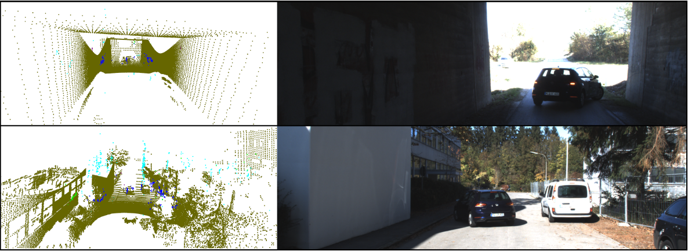
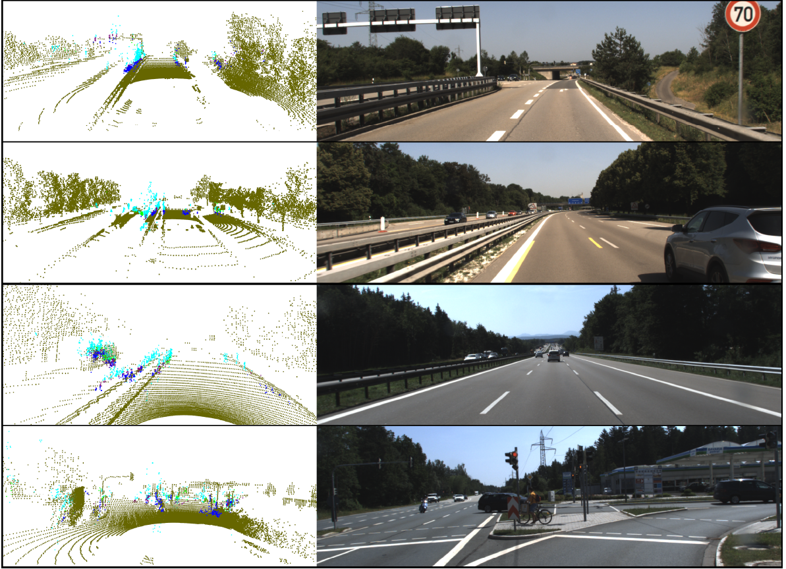

# PointNet.pytorch
This repo is continuation of PointNet(https://arxiv.org/abs/1612.00593) in pytorch to detect ghost points in radar point clouds. The model is in `pointnet/model_custom.py`.

It is tested with pytorch-1.0.

# Dataset

The dataset was a custom dataset which was used to train and test the model and cannot be shared as it was a propriatary dataset. Following instruction have to be followed to make your dataset ready for training.

1. Place the dataset into various folder as shown the sample folder in the custom dataset.
2. Place the calibration information for each dataset  inthe calibration folder and change the calibration in the data_preprocess.ipynb to read your calibration data.
3. Place the radar point clouds in radar_hires1 folder and lidar in lidar_os1 folder in the dataset folder.

# Running the model

```
git clone https://github.com/Jagyan/ghost_radarpoint_detection.git
cd ghost_radarpoint_detection
pip install -e .
```

Build visualization tool
```
cd script
bash build.sh #build C++ code for visualization
```

Training 
```
cd utils
python train_custom.py --nepoch=<number_epochs> --dataset_path='/home/mahapatro/pointnet.pytorch/custom_data/'
```

Testing
```
cd utils
python test_custom.py --dataset_path='/home/mahapatro/pointnet.pytorch/custom_data/'
```

# Performance

## Ghost point detection performance

On Custom dataset:

| Method | Training Accuracy (%) | Test Accuracy (%) | 
| :---: | :---: | :---: |
| Random Split training | 89.4 | 79.1 |
| Dynamic-Static Split training | 94.7 | 85.13 |
| Data Augmentation | 94.8 | 85.17 |
| Training with weight decay | 94.8 | 89.17 |


# Qualitative results

## Static scene



## Dynamic scene



Olive colored point are lidar points, blue points are correctly classified true radar points, green points are incorrectly  classified true radar points, teal points are correctly classified ghost radar points and purple points are incorrectly classified ghost radar points.

The report submitted for this project is the following file: [Project Report](Project_Report.pdf)
