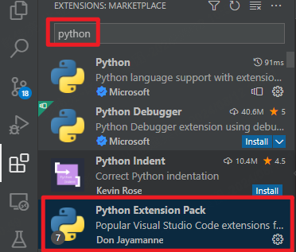
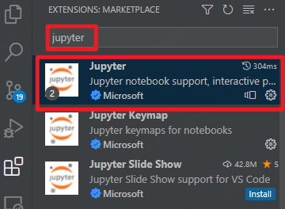
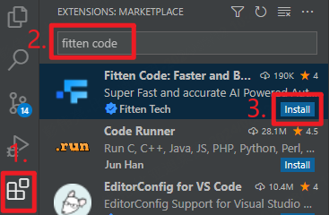
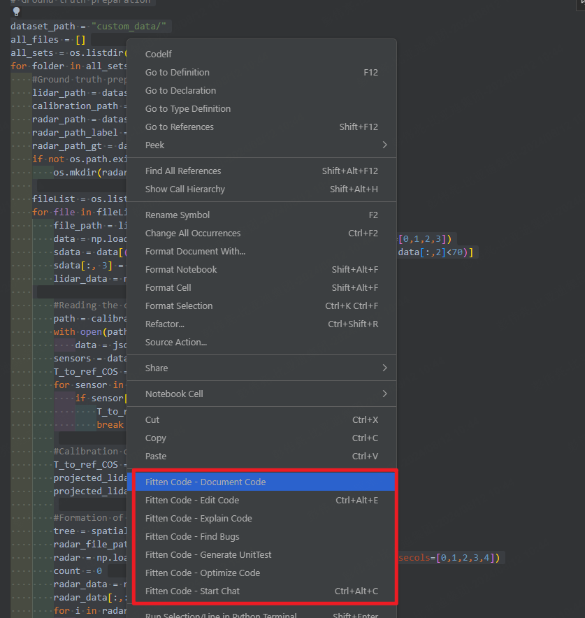

# 1. 插件安装

## 1.1. python 相关

可以一键安装python插件合集

jupyter记事本插件：

## 1.2. vscode AI插件推荐：Fitten code

安装完成后点击边栏中fitten code的图标，登录后直接使用，详细指南可以查看官方链接：<https://code.fittentech.com/tutor_vscode_zh>

基础用法：

> 1. 直接开启对话；
> 2. 选中不懂的代码，点击右键，让其解释；
> 3. 优化代码；
> 4. 生成代码；
> 5. ...

