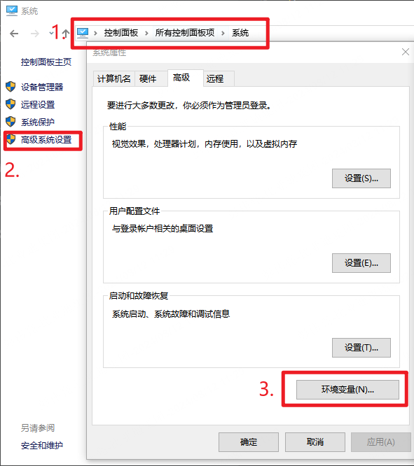
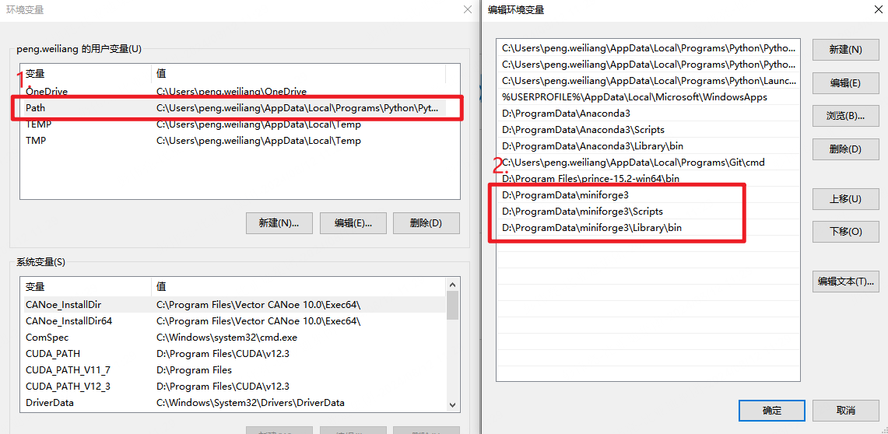
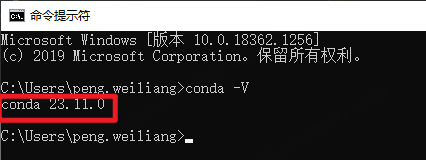
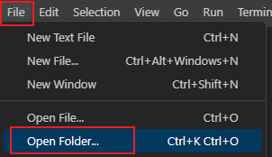
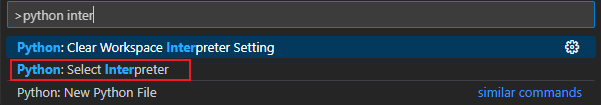
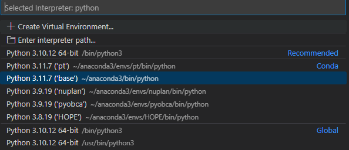
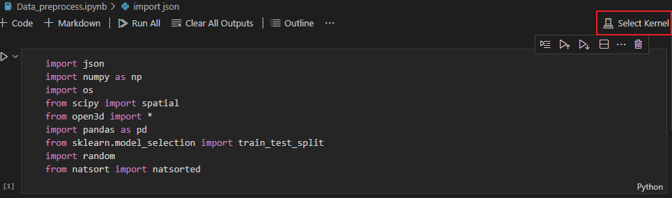

# 1. 环境配置

## 1.1. 安装conda

* 公司无法使用 anaconda，可以使用 miniforge 替代

## 1.2. 配置windows环境变量

直接搜索控制面板，找到所有项 > 系统 > 高级系统设置 > 环境变量



选择用户变量中 `Path` ，在最后添加 miniforge 安装目录下的3个文件文件夹目录



检查是否安装成功，打开cmd终端，输入 `conda -V`



返回相对应版本号，环境变量配置成功

## 1.3. 创建虚拟环境

python 开发中可能会因为版本的不同存在冲突，所以使用 conda 命令创建指定版本的虚拟环境，以灵活切换工程所需的虚拟环境

* 打开 miniforge 终端，输入以下命令，创建 conda 虚拟环境并激活：

``` bash
# 创建新的环境
conda create -n <env_name> python=3.10.0
# 激活环境
conda activate <env_name>
```

`<env_name>` 替换成自己想创建的环境名字， `python=3.10.0` 指定了python 版本

* 配置镜像源：

为了安装相关包更加快速稳定，配置 pip 国内镜像源（这里使用清华源）

``` bash
pip config set global.index-url https://pypi.tuna.tsinghua.edu.cn/simple
```

* 安装依赖：

``` bash
pip install -r requirements.txt
```

* 安装 pytorch：

``` bash
pip install torch torchvision torchaudio --index-url https://download.pytorch.org/whl/cu121
```

如果下载缓慢可以使用浏览器下载，在下载文件的目录打开终端，输入 `pip install 下载的文件名`

## 1.4. 使用vscode进行pyhton开发

* 在 vscode 中打开工程文件夹



* 选择自己创建的虚拟环境，按 `shift + ctrl + p`，搜索 `python interpreter`，选择环境





* 如果使用 jupyter 脚本运行同样需要选择对应环境

