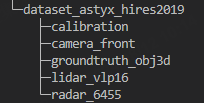
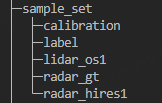

## 数据集制作

首次运行该仓库需要自行制作数据集，将数据集放入custom_data文件夹中。

* astyx数据集文件目录如下：



* custom_data/sample_set文件夹目录如下：



* 将astyx文件夹放入custom_data/sample_set对应文件夹中：

> 1. calibration -> calibration
> 2. lidar_vlp16 -> lidar_os1
> 3. radar_6455 -> radar_hires1

其余文件夹保持不变，后续使用 `Data_preprocess.ipynb` 脚本自动生成；

## 训练模型

可以直接参考本仓库的 `README.md` 文件，训练模型。

### 训练

``` bash
# 在utils文件夹下运行
cd utils
# 训练100轮
python train_custom.py --nepoch=100 --dataset_path="../custom_data/"
```

### 测试

``` bash
cd utils
python test_custom.py --dataset_path="../custom_data/"
```
